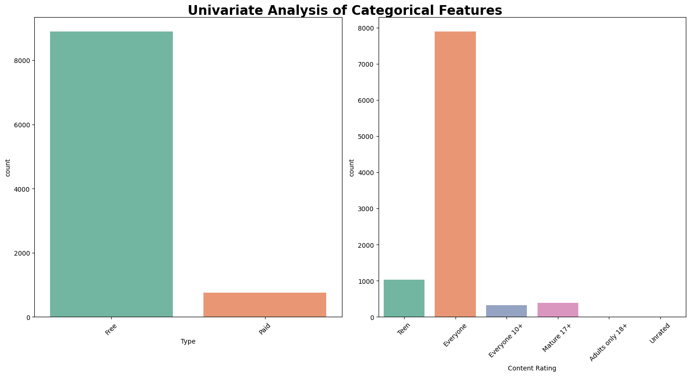

## GOOGLE PLAY STORE EXPLORATORY DATA ANALYSIS
An end-to-end Python data analytics project focused on cleaning, transforming, and analyzing over 10000 apps from the Google Play Store dataset using Pandas. The goal is to analyze the app market to understand category trends, pricing strategies, user ratings, and download patterns. These insights can help app developers align their products with current market demands.

---

## Tech Stack & Tools
* **Language:** Python
* **Libraries:** Pandas, NumPy
* **Visualization:** Matplotlib, Seaborn 
* **Environment:** Visual Studio Code 

---

## Data Cleaning and Preprocessing
Before analysis, the raw data was cleaned to ensure accuracy:

* **`Reviews` Cleaning:** 
  * Dropped the only string data "3.0M" from reviews column and converted the entire column to integer data type.

* **`Size` Cleaning:** 
  * The raw Size column was stored as text strings with varying units ("M" for Megabytes, "k" for Kilobytes) alongside unstructured text values like "Varies with     device". 
  * *Handling Missing Values:* I replaced the non-numeric string "Varies with device" with standard NaN (np.nan) values.
  * *Creating a Kilobyte Mask:* I defined a boolean mask (is_k) using .str.contains('k') to isolate rows that were originally in Kilobytes.
  * *Character Stripping & Type Casting:* I stripped both the "M" and "k" text indicators from the entire column and cast the values to float.
  * *Alignment with .loc:* Using my boolean mask and .loc indexer, I targeted only the rows that were originally in Kilobytes and divided them by 1024 to 
     scale them down to Megabytes:
    df_copy.loc[is_k, "size"] = df_copy.loc[is_k, "Size"] / 1024

  * **`Installs` Cleaning:** 
    * Values were written as text with extra characters (e.g., "10,000,000+").
    * I used a loop to strip out the + and , characters, then converted the column to integers (whole numbers)
    char_to_change = ['+', ',']
    for char in char_to_change:
      df_copy['Installs'] = df_copy['Installs'].str.replace(char, '')
    df_copy['Installs'] = df_copy['Installs'].astype(int)

  * **`Price` Cleaning:** 
    * Paid apps had a dollar sign in front of the price (e.g., "$4.99"), making it text instead of a number.
    * I removed the $ symbol and converted the column to floats (decimal numbers).
    df_copy['Price'] = df_copy['Price'].str.replace('$', '').astype(float)

  * **Date Time Conversion:**
  * The **Last Updated** column originally had dates written as text strings (like "January 7, 2018"), which Python cannot use for timeline analysis.
  * I converted this column into a real computer-readable format using pd.to_datetime().
  * To make it easier to see trends, I extracted three separate columns from it:  `Day`,`Month` and `Year`.
  * Finally, I removed the old text-based column to keep the dataset clean and lightweight. 

* **Addressing Null Values:**
  * The columns `Type`, `Current Ver`, and `Android Ver` had only a few missing values (just 1 or 2 rows each).
  * Instead of trying to guess or fill in these missing values, I used `dropna()` with the `subset` parameter to delete only the specific rows where these columns were empty.

* **Missing Value Imputation:** Handled `Rating` and `Size` using **Grouped Median Imputation**. I didn't just fill it with a generic average of the whole dataset. 
  
* **Duplicates:** 
  * Sorted the entire dataset by `Reviews` in descending order (`ascending=False`) so the largest, most recent record for each app was pushed to the top.
  * Removed duplicate entries based on the `App` name while keeping the first occurrence (`keep='first'`).

* **Data Pipeline Storage:** Saved the fully processed dataframe into a clean, standalone file: `Data/google_playstore_cleaned.csv`.

---

## Repository Structure

* `/Data`: Original raw dataset (`googleplaystore.csv`) and cleaned dataset.
  (`google_playstore_cleaned. csv`)
* `/Images`: Contains visualizations generated using matplotlib and seaborn.
* `/Googleplaystore.ipynb`: Cleaned and analyzed Jupyter Notebook file.
* `/README.md`: Markdown page containing project details.
* `/Requirements.txt`: Contains List of libraries.

----

##  Key Insights & Analytical Findings
### 1. Distribution of Numeric Data 
* These charts show the typical patterns and shapes of our app data, making it easy to spot common values and extreme outliers.

### 2. Distribution of Categorical Data
* This chart shows Univariate Analysis of Categorical Data

### 3. Top 10 App Categories

* This chart shows top 10 popular App categories.

### 4. App Categories with Large number of installations
* This chart shows top 10 Apps with largest installations.

### 5. Number of Apps with 5.0 Ratings
* There are *271 apps* in the dataset that achieved a *5.0 rating*.

### 6. Correlation Analysis
* This heatmap shows how app metrics relate to each other, revealing a strong link between Installs and the number of user Reviews.

### 7. Time Series Analysis
* This line chart shows the steady growth of apps uploaded to the Google Play Store over time, with a massive spike in growth starting after 2016.

