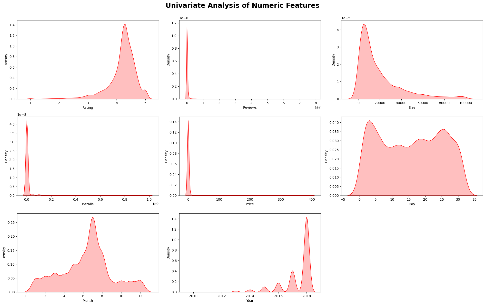
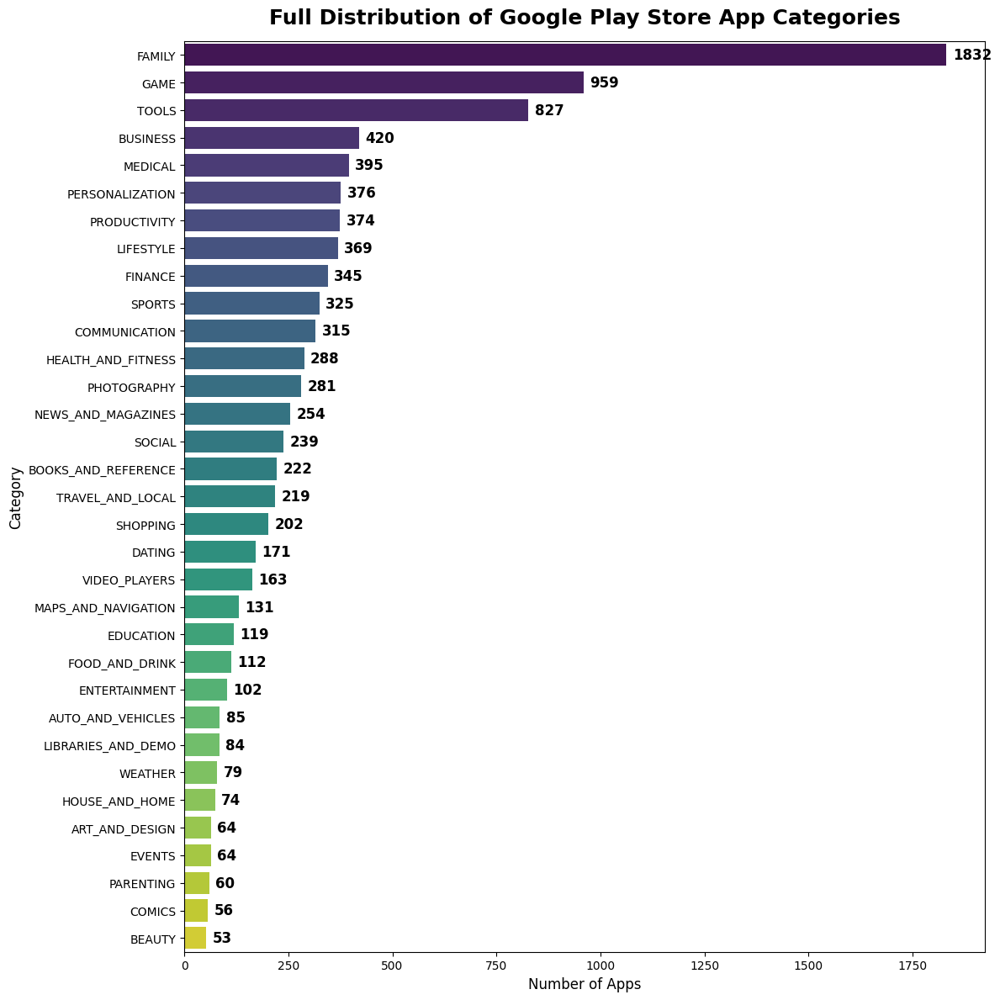
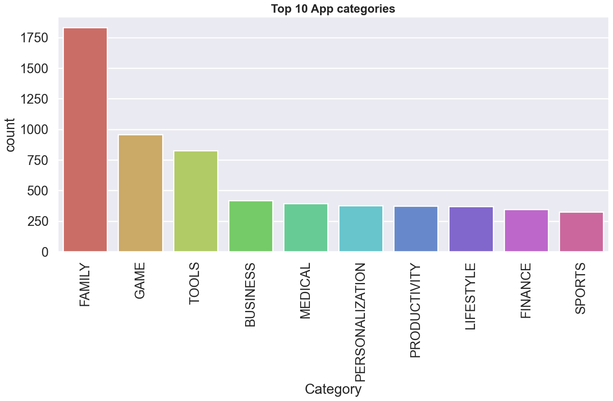
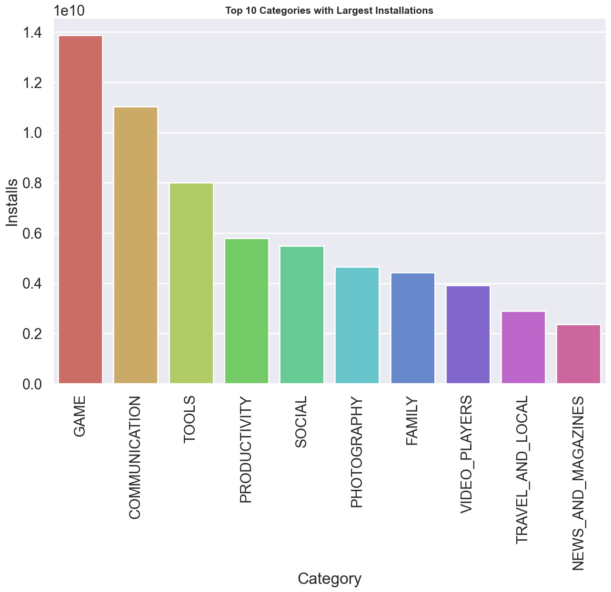
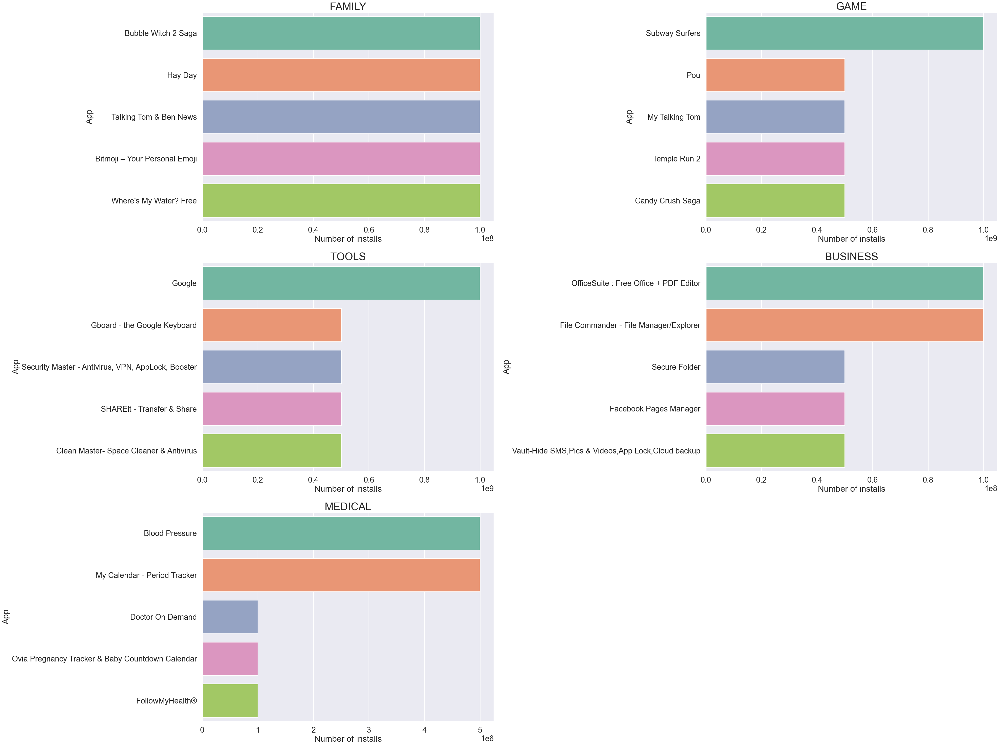
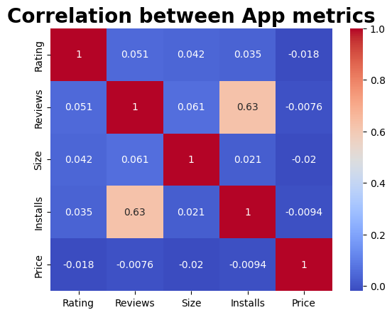
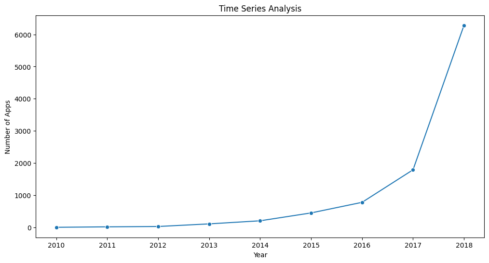

## GOOGLE PLAY STORE EXPLORATORY DATA ANALYSIS
An end-to-end Python data analytics project focused on cleaning, transforming, and analyzing over 10000 apps from the Google Play Store dataset using Pandas. The goal is to analyze the app market to understand category trends, pricing strategies, user ratings, and download patterns. These insights can help app developers align their products with current market demands.

---

## Tech Stack & Tools
* **Language:** Python
* **Libraries:** Pandas, NumPy
* **Visualization:** Matplotlib, Seaborn 
* **Environment:** Visual Studio Code 

---

## Data Cleaning and Preprocessing
Before analysis, the raw data was cleaned to ensure accuracy:
* **Missing Values:**  Handled null values in columns.

* **Data Type Conversion:** Converted `Reviews` to numeric, and stripped characters (like `+`, `,`, and `$`) from `Installs` and `Price` to turn them into numerical types.

* **`Size` Cleaning:** * Standardized the column by replacing "Varies with device" with NaN. Developed a data transformation pipeline using Python lambda functions to convert Megabytes (M) to Kilobytes by multiplying by 1,000, and stripped the k character from Kilobyte values, successfully casting the entire feature into a uniform numeric scale (KB).
  * Converting the final column to a clean float type.

  * **Missing Value Imputation:** Handled `Rating` and `Size` using **Grouped Median Imputation**. I didn't just fill it with a generic average of the whole dataset. 
  * Categorical Features `Type`, `Current Ver` and `Android Ver`: Filled null values using a **mode imputation (.mode()[0])** to maintain categorical consistency.

  * **Date Time Conversion:**
  * The **Last Updated** column originally had dates written as text strings (like "January 7, 2018"), which Python cannot use for timeline analysis.
  * I converted this column into a real computer-readable format using pd.to_datetime().
  * To make it easier to see trends, I extracted three separate columns from it:  `Day`,`Month` and `Year`.
  * Finally, I removed the old text-based column to keep the dataset clean and lightweight. 

* **Duplicates:** Identified and removed duplicate app entries to avoid skewed analysis.

* **Data Pipeline Storage:** Saved the fully processed dataframe into a clean, standalone file: `Data/google_playstore_cleaned.csv`.

---

## Repository Structure

* `/Data`: Original raw dataset (`googleplaystore.csv`) and cleaned dataset.
  (`google_playstore_cleaned. csv`)
* `/Images`: Contains visualizations generated using matplotlib and seaborn.
* `/Googleplaystore.ipynb`: Cleaned and analyzed Jupyter Notebook file.
* `/README.md`: Markdown page containing project details.
* `/Requirements.txt`: Contains List of libraries.

----

##  Key Insights & Analytical Findings
### 1. Distribution of Numeric Data 
* These charts show the typical patterns and shapes of our app data, making it easy to spot common values and extreme outliers.

### 2. Distribution of Categorical Data
* This chart shows which app categories are the most common on the market, led by Family, Games, and Tools.

### 3. Top 10 App Categories

* This chart shows top 10 popular App categories.

### 4. App Categories with Large number of installations
* This chart shows top 10 Apps with largest installations.

### 5. Top 5 Apps in Popular Categories
* This chart shows the Top 5 most installed apps in each popular category.

### 6. Number of Apps with 5.0 Ratings
* There are *271 apps* in the dataset that achieved a *5.0 rating*.

### 7. Correlation Analysis
* This heatmap shows how app metrics relate to each other, revealing a strong link between Installs and the number of user Reviews.

### 8. Time Series Analysis
* This line chart shows the steady growth of apps uploaded to the Google Play Store over time, with a massive spike in growth starting after 2016.

